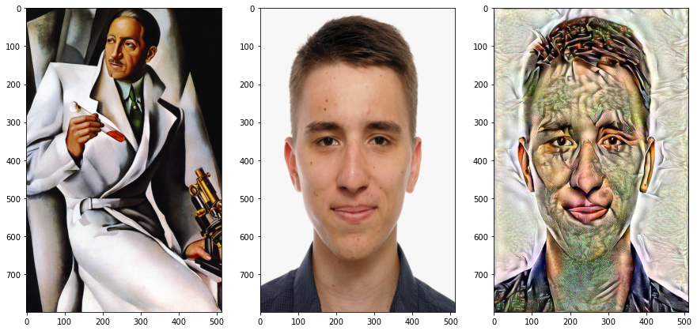
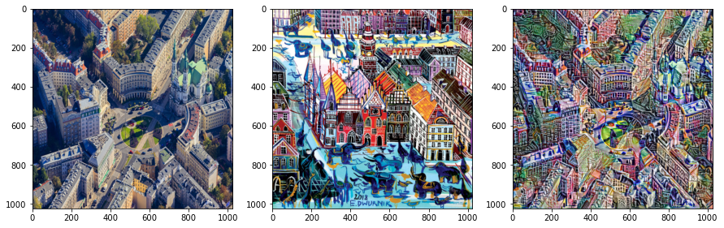
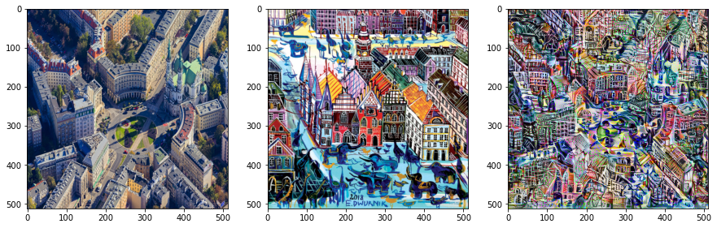
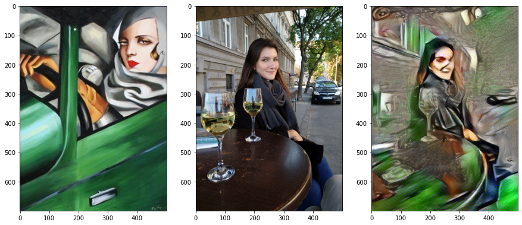
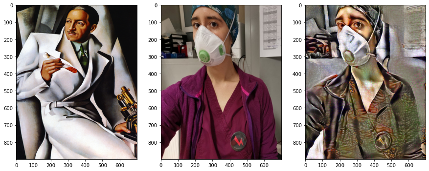

# Transfer Stylu

Użycie VGG19 do ekstrakcji cech ze zdjęcia kontentowego oraz stylu. Użycie Gramianu do porównania styli zdjęć i iteracyjna optymalizacja wyglądu jednego z obrazów względem drugiego.

Projekt jest w trakcie wykonania, praca na najbliższe miesiące:

1. Przepisanie notebooków na skrypty.
2. Uruchomnienie obsługi TensorFlow przez GPU.
3. Optymalizacja funkcji kosztów.
4. Dodanie elementów odpowiadających za bezpośrednie porównanie konturów, poligonów i tekstur, jako oddzielne elementy i oddzielne nanoszenie zmian na te komponenty.

Przykładowe wyniki.

Pejzaż pl. Zbawiciela.

2500 iteracji optymalizacji.

2600 iteracji optymalizacji.

